<](https://react.dev/)
[](https://vite.dev/)
[](https://www.typescriptlang.org/)
[](LICENSE)

**Antarmuka premium modern** untuk melacak siklus menstruasi, mencatat kondisi harian, dan melihat prediksi AI — dibangun dengan **React + Vite** serta desain **glassmorphism** yang interaktif.

[Fitur Utama](#-fitur-utama) · [Arsitektur](#️-arsitektur-sistem) · [Quick Start](#-quick-start) · [Pages Overview](#-pages-overview) · [API Integration](#-api-integration)

</div>

---

## 🏗️ Arsitektur Sistem

### Full-Stack Overview

Berikut adalah arsitektur keseluruhan sistem **YeoCycles** yang menunjukkan bagaimana Frontend berinteraksi dengan Backend dan ML Service:

<p align="center">
  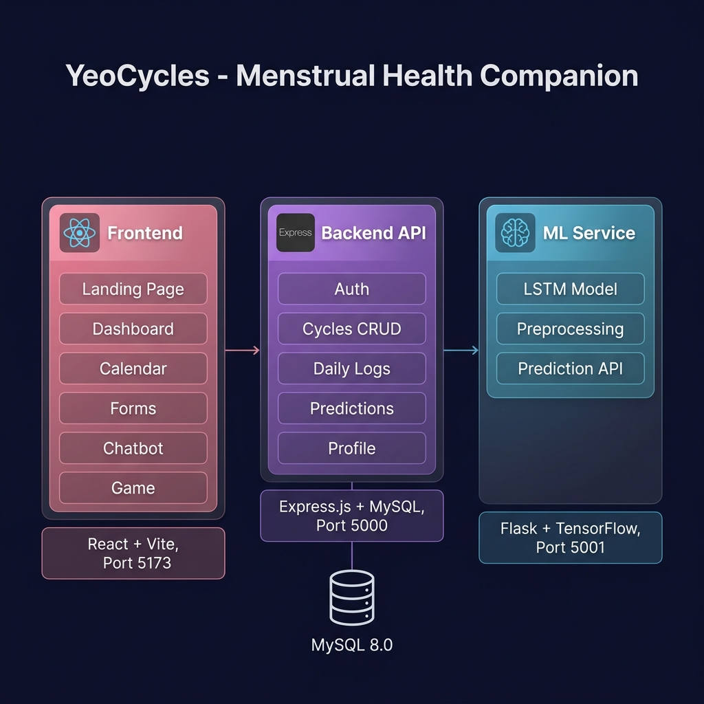
</p>

### Frontend Internal Architecture

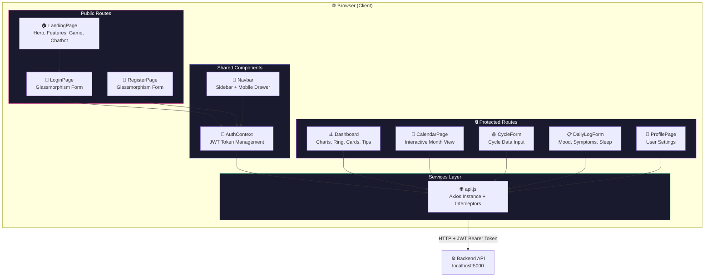

### Component Dependency Graph

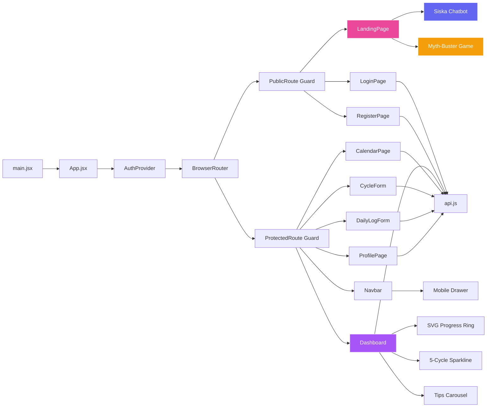

---

## ✨ Fitur Utama

### 🏠 Landing Page — Premium Experience

<p align="center">
  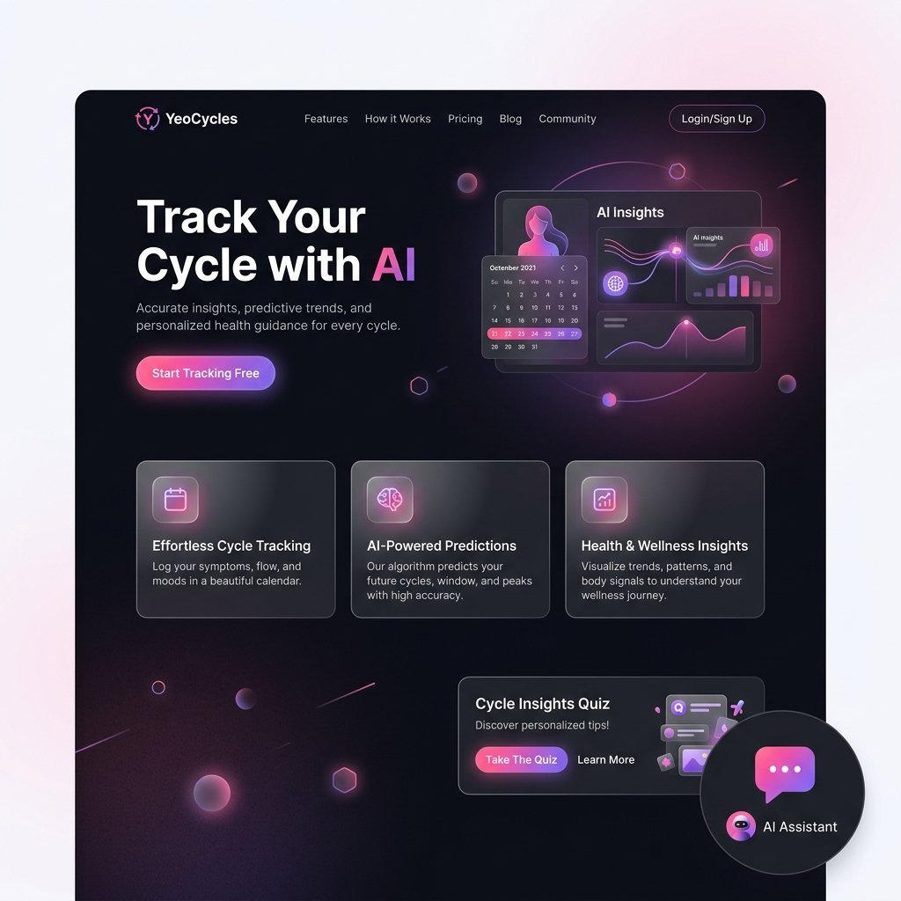
</p>

| Fitur | Deskripsi |
|-------|-----------|
| **Hero Section** | Gradient animation dengan floating geometric shapes |
| **Feature Cards** | Hover lift effects dengan glassmorphic cards |
| **Edukasi Interaktif** | Menstrual education section dengan accordion cards |
| **Cycle Myth-Buster Game** 🎮 | Quiz 10 pertanyaan, progress bar, score tracker, confetti, penjelasan ilmiah |
| **Siska AI Chatbot** 🤖 | Keyword-based NLP, strict topic filter, typing animation |
| **Footer** | "Powered by kamidukung.biz.id" dengan gradient link |
| **Mobile Nav** | Hamburger slide-in overlay + backdrop blur |

#### Chatbot Siska — Alur Kerja

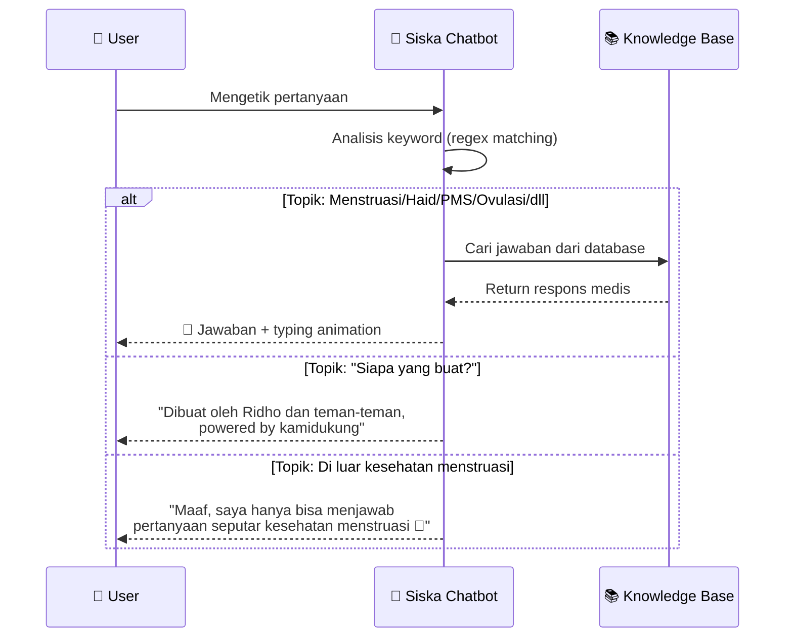

#### Myth-Buster Game — Flow

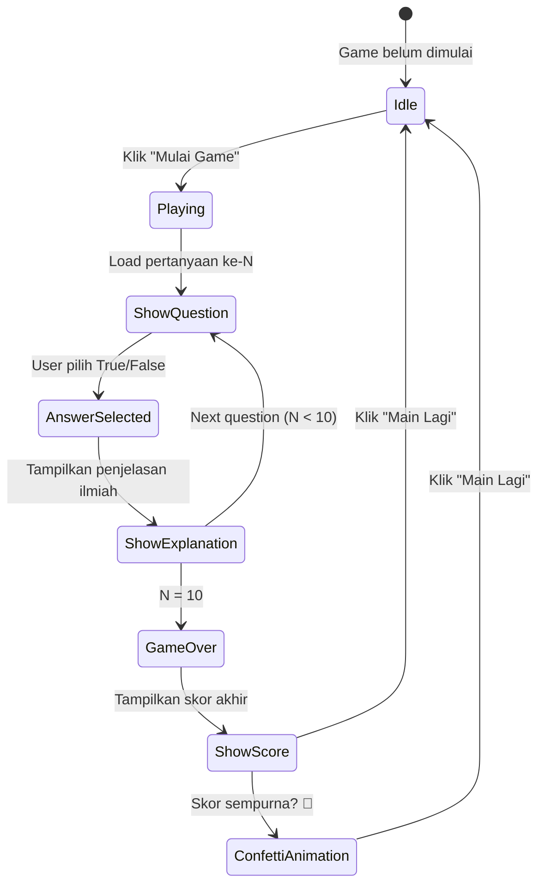

---

### 🔐 Auth Pages — Glassmorphism Design

<p align="center">
  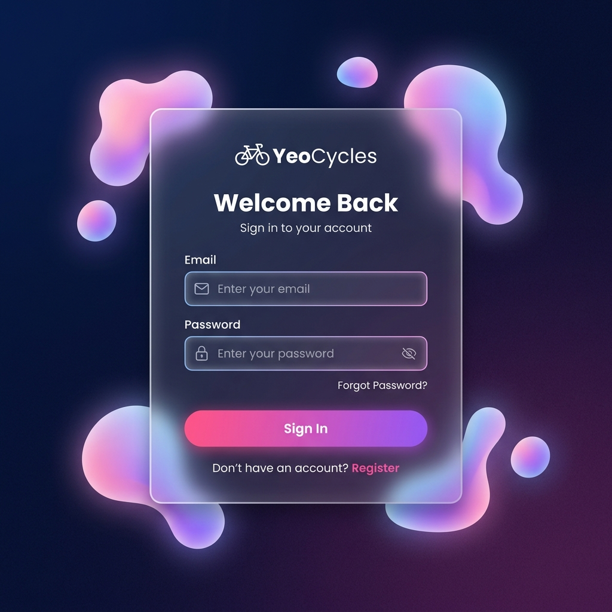
</p>

| Teknik | Implementasi |
|--------|-------------|
| **Glassmorphism** | `backdrop-filter: blur(20px)` + `rgba(255,255,255,0.08)` |
| **Animated Blobs** | CSS `@keyframes blob-morph` — 8s infinite morphing |
| **Gradient Border** | Linear gradient border via pseudo-elements |
| **Input Glow** | Focus state dengan `box-shadow: 0 0 20px rgba(236,72,153,0.3)` |
| **Password Toggle** | Eye icon toggle visibility |
| **Loading State** | Spinner animation saat submit |

---

### 📊 Dashboard — Interactive Data Visualization

<p align="center">
  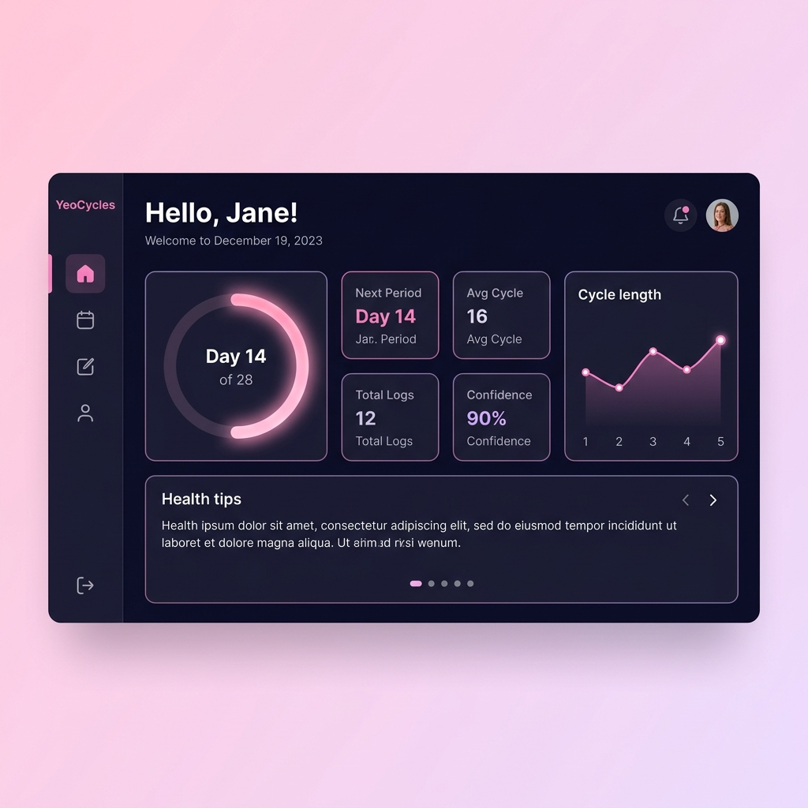
</p>

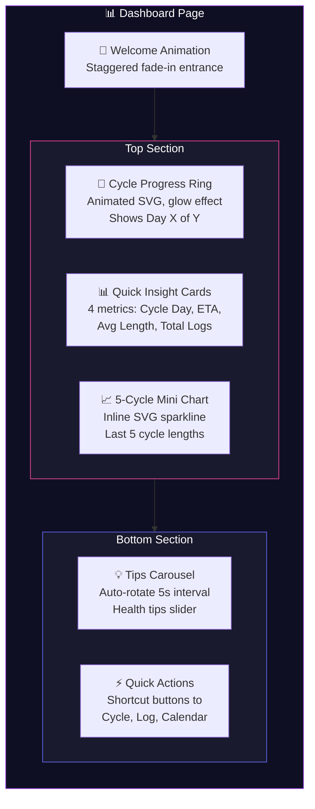

**Dashboard Data Flow:**

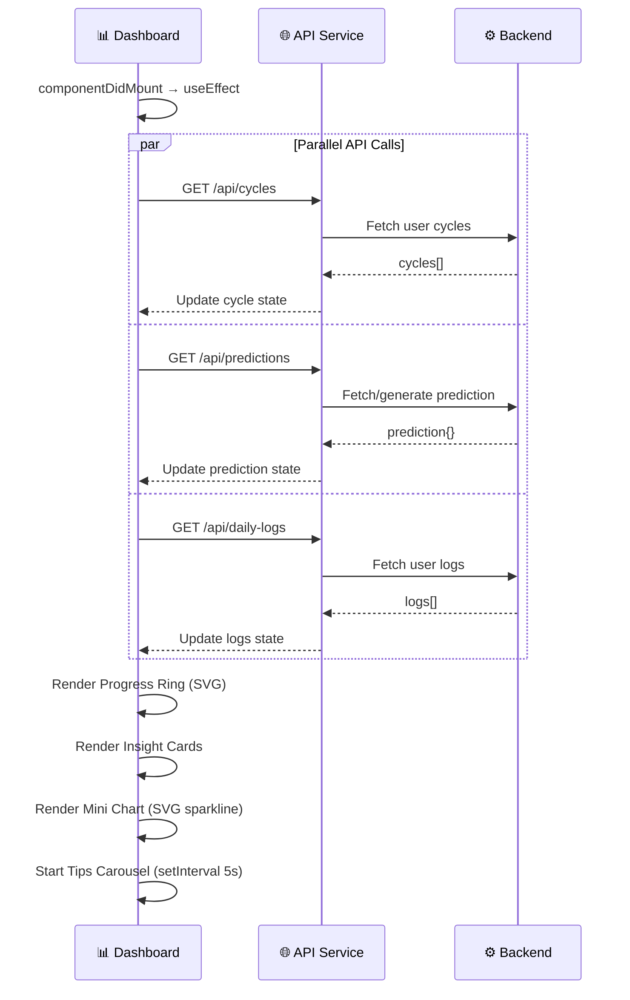

---

## 🛠️ Tech Stack

| Technology           | Version | Purpose                              |
| -------------------- | ------- | ------------------------------------ |
| **React**            | 19.1    | UI Library (Hooks, Context, Router)  |
| **Vite**             | 8.0     | Build tool & dev server (HMR)        |
| **TypeScript**       | 5.9     | Type safety & DX                     |
| **React Router**     | 7.x     | Client-side routing & route guards   |
| **Axios**            | 1.x     | HTTP client with interceptors        |
| **Vanilla CSS**      | —       | Custom styling (no framework)        |

### Design Techniques

| Technique | Implementation |
|-----------|---------------|
| **Glassmorphism** | `backdrop-filter: blur()` + semi-transparent backgrounds |
| **CSS Custom Properties** | Design tokens for consistent theming |
| **CSS Animations** | `@keyframes` — floating shapes, fade-ins, slide-ins |
| **SVG Graphics** | Inline SVGs — charts, progress rings, decorative elements |
| **CSS Grid + Flexbox** | Responsive layouts without media query complexity |
| **Mobile-First** | All styles built from `320px` upward |

---

## 🚀 Quick Start

### Prerequisites

- **Node.js** ≥ 18.x · **npm** ≥ 9.x
- Backend API at `http://localhost:5000` ([Backend Repo](https://github.com/Coding-Camp-Capstone-Project-2026/backend))

```bash
# 1. Clone repository
git clone https://github.com/Coding-Camp-Capstone-Project-2026/frontend.git
cd frontend

# 2. Install dependencies
npm install

# 3. Start development server (HMR)
npm run dev
# → http://localhost:5173

# 4. Build for production
npm run build

# 5. Preview production build
npm run preview
```

> **⚠️ Penting**: Pastikan Backend API dan ML Service sudah berjalan sebelum menggunakan fitur prediksi.

---

## 📁 Project Structure

```
frontend/
├── package.json                 # Dependencies & scripts
├── index.html                   # HTML entry point (SPA shell)
├── tsconfig.json                # TypeScript configuration
├── vite.config.ts               # Vite build configuration
├── docs/
│   └── images/                  # Documentation visuals
├── public/
│   ├── favicon.svg              # App favicon
│   └── icons.svg                # SVG icon sprites
└── src/
    ├── main.jsx                 # 🚀 React entry point
    ├── App.jsx                  # 🏠 Root — routing & auth guards
    ├── index.css                # 🎨 Global styles, CSS vars, resets
    ├── context/
    │   └── AuthContext.jsx      # 🔐 Auth state provider
    ├── components/
    │   ├── Navbar.jsx           # 🧭 Nav + mobile drawer
    │   └── Navbar.css           # Sidebar & drawer styles
    ├── pages/
    │   ├── LandingPage.jsx      # 🏠 Hero, features, game, chatbot
    │   ├── LandingPage.css      # Landing animations (53KB)
    │   ├── LoginPage.jsx        # 🔑 Login form
    │   ├── RegisterPage.jsx     # 📝 Registration form
    │   ├── Auth.css             # Glassmorphic auth styling
    │   ├── Dashboard.jsx        # 📊 Charts, ring, cards
    │   ├── Dashboard.css        # Dashboard animations
    │   ├── CalendarPage.jsx     # 📅 Interactive calendar
    │   ├── CalendarPage.css     # Calendar grid
    │   ├── CycleForm.jsx        # 🩸 Cycle input form
    │   ├── DailyLogForm.jsx     # 📋 Daily health log
    │   ├── FormPage.css         # Shared form styling
    │   ├── ProfilePage.jsx      # 👤 Profile management
    │   └── ProfilePage.css      # Profile styling
    └── services/
        └── api.js               # 🌐 Axios instance & interceptors
```

---

## 🗺️ Routing

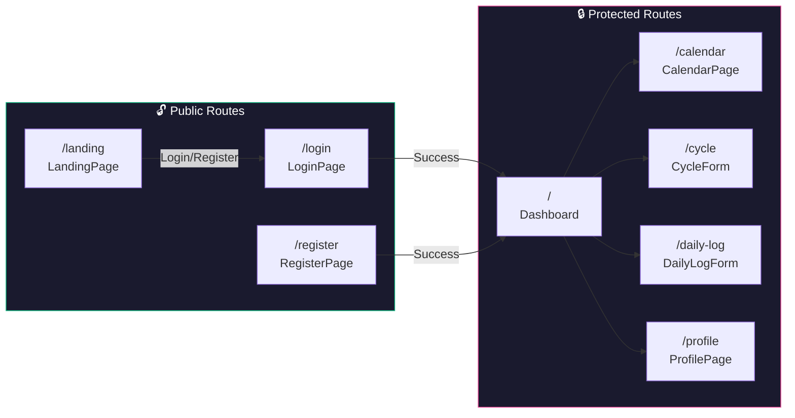

| Path | Component | Auth | Description |
|------|-----------|------|-------------|
| `/landing` | `LandingPage` | Public | Landing page (hero, game, chatbot) |
| `/login` | `LoginPage` | Public | Halaman login |
| `/register` | `RegisterPage` | Public | Halaman registrasi |
| `/` | `Dashboard` | 🔒 Protected | Dashboard utama |
| `/calendar` | `CalendarPage` | 🔒 Protected | Kalender siklus interaktif |
| `/cycle` | `CycleForm` | 🔒 Protected | Form input siklus |
| `/daily-log` | `DailyLogForm` | 🔒 Protected | Form log harian |
| `/profile` | `ProfilePage` | 🔒 Protected | Profil pengguna |

---

## 🔐 State Management — AuthContext

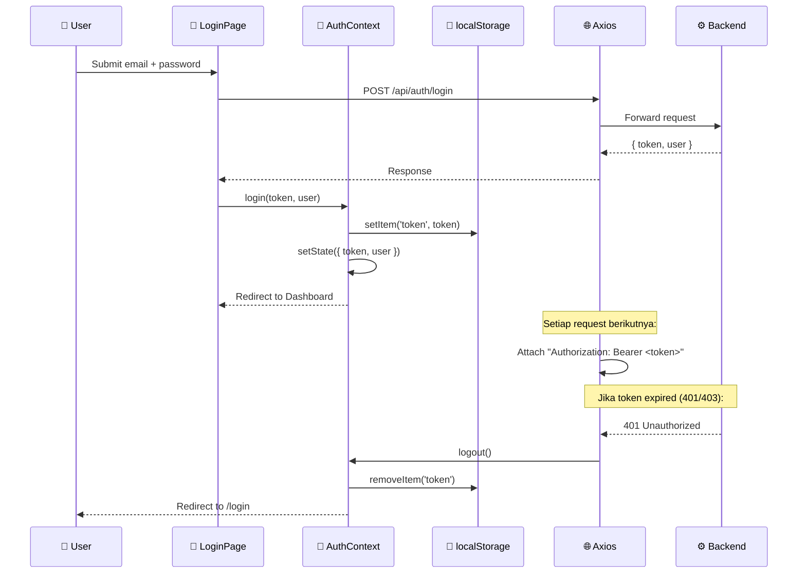

---

## 🌐 API Integration

### API Endpoints per Page

| Page | Method | Endpoint | Description |
|------|--------|----------|-------------|
| **LoginPage** | POST | `/api/auth/login` | Autentikasi |
| **RegisterPage** | POST | `/api/auth/register` | Registrasi |
| **Dashboard** | GET | `/api/cycles` | Data siklus |
| | GET | `/api/predictions` | Prediksi ML |
| | GET | `/api/daily-logs` | Daily logs |
| **CalendarPage** | GET | `/api/cycles` | Data siklus |
| | GET | `/api/daily-logs?start=&end=` | Filter range |
| **CycleForm** | POST/PUT | `/api/cycles` | CRUD siklus |
| **DailyLogForm** | POST | `/api/daily-logs` | Tambah log |
| **ProfilePage** | GET/PUT | `/api/profile` | CRUD profil |

---

## 🎨 Design System

### Color Palette

```css
--primary: #ec4899;      /* Pink */
--secondary: #a855f7;    /* Purple */
--accent: #6366f1;       /* Indigo */
--bg-dark: #0f0f23;      /* Navy background */
--surface: #1a1a2e;      /* Card surface */
--glass-bg: rgba(255, 255, 255, 0.08);
--glass-border: rgba(255, 255, 255, 0.15);
```

### Animation Library

| Animation | Duration | Usage |
|-----------|----------|-------|
| `float` | 6–8s | Floating shapes |
| `fadeInUp` | 0.6s | Page entrances |
| `slideInRight` | 0.3s | Mobile drawer |
| `pulse-glow` | 2s | Progress ring |
| `gradient-shift` | 3s | Auth background |
| `blob-morph` | 8s | Morphing blobs |
| `typing-dots` | 1.4s | Chatbot typing |
| `confetti-fall` | 1s | Game completion |

### Responsive Breakpoints

| Breakpoint | Target |
|------------|--------|
| `≤480px` | Small phones — single column |
| `≤768px` | Tablets — hamburger nav |
| `≤1024px` | Small laptops — condensed sidebar |
| `≥1025px` | Desktop — full layout |

---

## 📱 Mobile Responsiveness

| Feature | Implementation |
|---------|---------------|
| **Touch targets** | Min `44×44px` semua interactive elements |
| **Safe area** | `env(safe-area-inset-*)` untuk notched phones |
| **Fluid typography** | `clamp()` untuk font sizes |
| **Hamburger menu** | Slide-in drawer + backdrop blur |
| **Form layouts** | Stack vertical, full-width inputs |
| **Card grids** | Auto-collapse to single column |
| **Chatbot** | Full-screen mode on mobile |

---

## ⚙️ Build & Deploy

```bash
npm run dev          # Dev server + HMR → localhost:5173
npm run build        # Production build → /dist
npm run preview      # Preview production locally
```

---

## 🔗 Related Repositories

| Repository | Description | Link |
|------------|-------------|------|
| **Frontend** | React SPA (this repo) | [frontend](https://github.com/Coding-Camp-Capstone-Project-2026/frontend) |
| **Backend** | Express.js REST API | [backend](https://github.com/Coding-Camp-Capstone-Project-2026/backend) |
| **Machine Learning** | Flask + LSTM Service | [machinelearning](https://github.com/Coding-Camp-Capstone-Project-2026/machinelearning) |

---

## 👥 Tim Pengembang

Dibuat oleh **Ridho dan teman-teman** — Capstone Project Coding Camp 2026

**Powered by [kamidukung.biz.id](https://kamidukung.biz.id/)**
]]>
